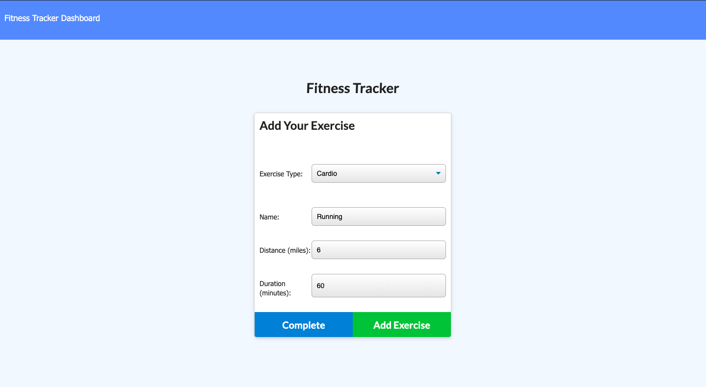

# Fitness Tracker

# Description
A simple workout app designed to allow the user to input various workouts and track progress. The app categorizes workouts as either resistance or cardio and allows the user to put in information such as weight, reps, sets, duration, and distance.

# Technologies used
- HTML
- CSS
- JavaScript
- Express
- MongoDB
- Mongoose
- Compression
- Service worker
- Data Caching

# Links
- GitHub Repository: https://github.com/ashtonwalden34/fitness-tracker
- Deployed application: https://boiling-sea-09640.herokuapp.com/

# Road Map
- Incorporate graphs to provide a better visual analyzation of workouts.
- Create an easier path to view previous workouts and track progress over time.
